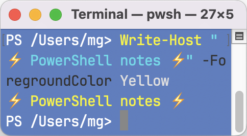

# PowerShell notes

This repository contains notes and PowerShell snippets that I saved because, for some reason, I found them useful :) The goal is to avoid reinventing the wheel.

## License

This repo is released under the [Unlicense](LICENSE) license.
